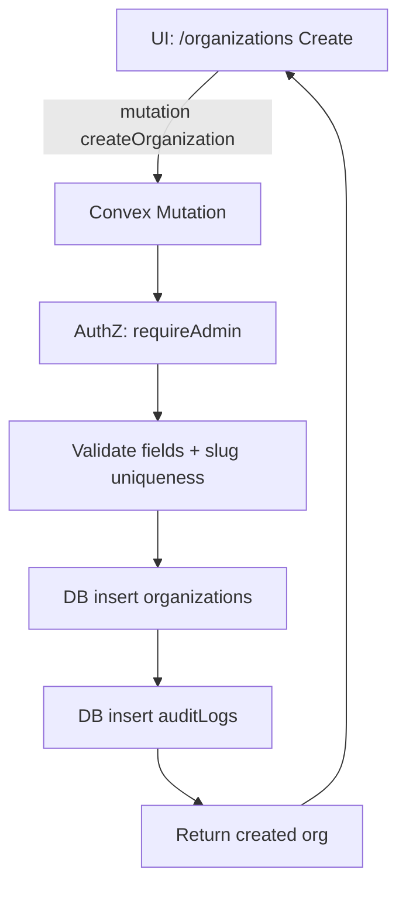
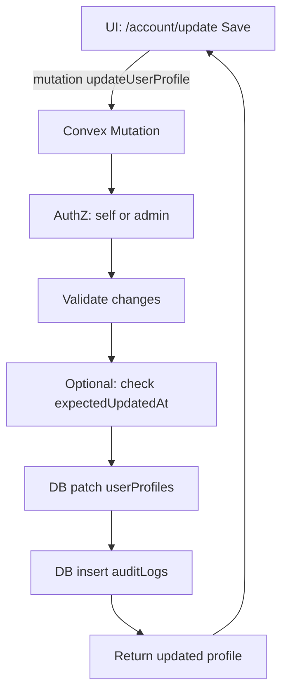
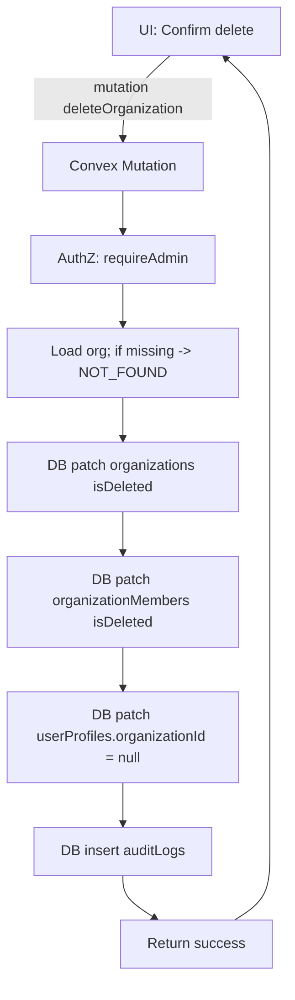

## What “Complete CRUD Data Flow” Means Here
- UI (Next.js pages/components) triggers mutations/queries.
- Convex functions enforce auth + validation + business rules, then read/write Convex tables.
- All writes produce audit log rows.
- Lists support filtering + cursor pagination.
- Updates use optimistic locking (`expectedUpdatedAt`).
- Deletes are soft-deletes with defined cascade behavior.

## Entities (Relational Core)
- `userProfiles` (existing): account/profile record per user.
- `organizations` (exists): organization master record.
- `organizationMembers` (to add): join table linking users ↔ organizations (role/permissions).
- `auditLogs` (exists): append-only record of create/update/delete.

## Remove Mock Data (Source of Truth)
- Remove Zustand stores and mock exports currently driving org/team/dashboard pages:
  - `seller-provider/data/index.ts`: `mockOrganization`, `teamMembers`, `dashboardStats`, `revenueChartData`, `mockUser`.
  - `app/(dashboard)/organization/_hooks/useOrganizationStore.ts` and related hooks.
  - `app/(dashboard)/dashboard/_hooks/useDashboardStore.ts`.
- Replace each with Convex queries/mutations and small client hooks.

## CRUD Requirements Mapping
### 1) Create
- **Organizations**: `createOrganization` validates, inserts org, creates owner membership, patches `userProfiles.organizationId` (if desired), logs audit, returns the created org.
- **Organization Members**: `createOrganizationMember` validates role/permissions, inserts membership, logs audit, returns created membership.
- **Profiles**:
  - `ensureUserInitialized`/`ensureSellerInitialized` already cover “create if missing” for current user.
  - Add a strict `createUserProfile` (admin-only) if needed, otherwise treat profile creation as implicit via ensure.

### 2) Read
- **Organizations**: `listOrganizations` supports search + includeDeleted + cursor pagination; `getOrganization` returns NOT_FOUND via `throwAppError`.
- **Members**: `listOrganizationMembers` supports role/email filtering + pagination; `getOrganizationMember` missing-record errors.
- **Profiles**: `getUserProfile` and `getSellerProfile` already exist; add filtering/list only if required (admin directory).

### 3) Update
- **Organizations**: `updateOrganization` validates changes, checks `expectedUpdatedAt`, patches, logs audit (before/after), returns updated org.
- **Members**: `updateOrganizationMember` validates, checks optimistic lock, logs audit, returns updated member.
- **Profiles**: improve/keep `updateUserProfile` to:
  - enforce “self or admin” updates,
  - validate changes,
  - optionally add optimistic lock (add `expectedUpdatedAt` to args),
  - return updated profile, and log audit.

### 4) Delete
- Soft-delete by default (consistent with existing seller CRUD patterns).
- **Organizations**: `deleteOrganization` soft-deletes org, cascades by soft-deleting related members and clearing any `userProfiles.organizationId` references, logs audit, returns `{ success: true }`.
- **Members**: `deleteOrganizationMember` soft-deletes membership, blocks deleting the last owner, logs audit, returns success.
- **Profiles**: add `softDeleteUserProfile` (self or admin), with confirmation UI (if required), and audit log.

## Transactions / Atomicity
- Convex mutations are atomic/transactional. Multi-table operations (org + members + profile patch + audit insert) are implemented inside the same mutation so they commit/rollback together.

## Access Control & Separation of Concerns
- Server-side enforcement (never client-only):
  - Admin-only: organizations directory CRUD.
  - Org-scoped: require membership role owner/admin for team changes.
  - Profile updates: self or admin.
- Separation:
  - `convex/authz.ts`: auth helpers (requireAuth, requireAdmin, requireOrgRole).
  - `convex/*Repo.ts` style helpers (data access) vs `convex/*Service.ts` style (business rules) to keep logic readable and testable.

## Client Wiring (Concrete Pages)
- `/organizations` (admin directory): keep the CRUD UI, but ensure it consumes the final “return full record” APIs and shows backend validation errors.
- `/organization` (my org + team): replace mock Zustand with Convex-backed hooks:
  - Query current user’s org (via `userProfiles.organizationId` or membership lookup).
  - List team members paginated.
  - Create/edit/delete members with confirmation dialogs.
- `/dashboard`: replace mock stats store with a `dashboard.getStats({ from,to })` query computed from `sellerOrders/sellerProducts`.
- `/account/update`: keep form UX, but update to use new `expectedUpdatedAt` if we add optimistic lock for profiles.

## Performance
- Use search indexes for org name and member email.
- Cursor pagination everywhere.
- Cap limits server-side.
- Avoid N+1 by returning member summaries in list endpoints.

## Testing (Unit + Integration)
- Unit tests (Vitest):
  - slug/validation helpers, last-owner guard, permission mapping.
- Integration tests:
  - Add a Convex testing harness dependency and write tests that execute mutations/queries against a test DB:
    - org create→read→update (lock)→delete (cascade),
    - member CRUD + last-owner protection,
    - profile update constraints,
    - auditLogs written for each mutation.

## How It Works (End-to-End Flow)
- UI calls Convex query/mutation → Convex validates/authz → DB write/read → audit insert (writes) → UI renders results / toasts.

## Flowcharts (Mermaid)
### Organization Create

### Profile Update

### Organization Delete (Cascade)

## Acceptance
- Build passes, tests pass, and the org/team/dashboard/profile pages load with no mock-data dependencies.