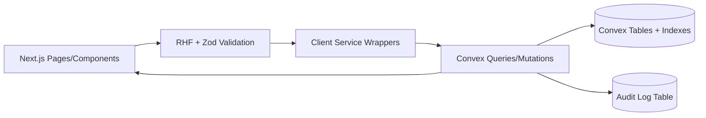

## What I Found (Deep Scan Summary)
- Deprecated seller-type/role logic is spread across Convex + seller-provider:
  - Role handling inconsistencies: [users.ts](file:///Users/ahmedmansour/Documents/GitHub/fu/convex/users.ts) returns synthetic `customer` profile in `getUserProfile`, creates `vendor` in `ensureUserInitialized`, and creates `customer` in `updateProfileImage`.
  - Provider config derives `entityType` from legacy `role` (freelancer→individual): [providers.ts](file:///Users/ahmedmansour/Documents/GitHub/fu/convex/providers.ts).
  - Frontend types still include `freelancer/customer`: [auth-types.ts](file:///Users/ahmedmansour/Documents/GitHub/fu/seller-provider/lib/auth-types.ts), [provider.ts](file:///Users/ahmedmansour/Documents/GitHub/fu/seller-provider/types/provider.ts).
  - Navigation still references removed `/analytics`: [providers.ts](file:///Users/ahmedmansour/Documents/GitHub/fu/seller-provider/config/providers.ts#L44-L51).
- Performance anti-patterns in Convex queries:
  - `services.getServices` and `bookings.getBookings` do `.collect()` then filter in-memory instead of pushing filters into indexed queries (can degrade with data size): [services.ts](file:///Users/ahmedmansour/Documents/GitHub/fu/convex/services.ts), [bookings.ts](file:///Users/ahmedmansour/Documents/GitHub/fu/convex/bookings.ts).
- Auth gating duplication:
  - Both [AuthGuard.tsx](file:///Users/ahmedmansour/Documents/GitHub/fu/seller-provider/app/(dashboard)/_components/AuthGuard.tsx) and [AuthWrapper.tsx](file:///Users/ahmedmansour/Documents/GitHub/fu/seller-provider/app/(dashboard)/_components/AuthWrapper.tsx) attempt “initialization/upgrade” flows; this increases race conditions and regressions.

## Objectives (Measurable)
- Remove deprecated seller types (`freelancer`, `customer` role paths) from seller-provider flows; vendor/admin only.
- Implement consistent CRUD patterns for seller-provider pages (services, products, categories, orders, organization, settings/account).
- Reduce query latency by eliminating collect-then-filter patterns; ensure all list queries are index-backed.
- Provide unified error codes and consistent UI error handling.
- Add tests for all CRUD flows and failure scenarios; target ≥90% coverage for new/changed modules.

## Architecture (Target)
- Keep folder structure, but standardize “service layer” and Convex boundaries:
  - Convex: `/convex/{users,providers,services,bookings,orders,products,categories,organization}.ts`
  - Seller-provider wrappers: `/seller-provider/services/{profiles,services,bookings,orders,products,categories}.ts`
  - UI pages remain in `/seller-provider/app/(dashboard)/...`

### Process Flow (Mermaid)

## Phase 1 — Line-by-Line Scan + Static Analysis Report
- Automated scanning (no behavior change):
  - Identify unused exports, dead code, duplicated utilities, and deprecated role logic.
  - Produce reports:
    - “Deprecated seller-type references” inventory
    - “Collect-then-filter queries” inventory
    - “Auth gating duplication” inventory
- Output docs:
  - `docs/REFRACTOR_REPORT.md` (anti-patterns, tight coupling, perf bottlenecks)
  - `docs/ARCHITECTURE_DIAGRAMS.md` (Mermaid diagrams per complex flows)

## Phase 2 — Remove Deprecated Seller-Type Code (Compatibility-Safe)
- Backend (Convex):
  - Make `userProfiles.role` a strict union (vendor/admin + transitional states if needed).
  - Remove `freelancer` mapping from provider config; stop deriving provider/entity from role.
  - Fix role creation consistency:
    - `getUserProfile` returns `null` (or vendor default) instead of synthetic `customer` for seller-provider.
    - `updateProfileImage` must not create `customer` role.
  - Add a dedicated upgrade/migration mutation if migration is needed.
- Frontend (seller-provider):
  - Update `UserRole` types: remove freelancer/customer.
  - Remove UI flows that depend on `role === "customer"` inside dashboard.
  - Remove navigation entry for `/analytics` (already deleted page) to avoid broken routes.
- Migration guide:
  - `docs/MIGRATION_GUIDE_DEPRECATED_SELLER_TYPES.md` describing mapping and rollout.

## Phase 3 — Standardized CRUD Patterns Per Feature
For each feature page under `/seller-provider/app/(dashboard)`:
- Create/Update:
  - Use React Hook Form + Zod schema
  - Use a feature service wrapper
  - Show consistent inline errors + toast; loading state
- Read:
  - Paginated table (cursor or limit/offset), sorting, filters, export CSV
  - All filters pushed into Convex query with indexes
- Delete:
  - Soft delete (isDeleted / isActive=false) + optional hard delete (admin only)
  - Confirmation dialog + integrity checks

Concrete targets (initial priority order):
1) Services (existing Convex functions, optimize query patterns)
2) Bookings (optimize query patterns + tables)
3) Orders (indexes + queries + table)
4) Products/Categories (align with convex schema; add missing Convex CRUD if required)
5) Organization page (persist organization info; eliminate state loops and unify validation)
6) Account/Settings (unify profile update + image upload)

## Phase 4 — Unified Error Codes + Security Hardening
- Introduce a shared Convex error utility:
  - Stable error codes (e.g., AUTH_REQUIRED, FORBIDDEN, NOT_FOUND, VALIDATION_FAILED, CONFLICT, INTEGRITY_BLOCKED)
  - Ensure UI maps codes to user-friendly Arabic/English messages.
- Authorization:
  - Centralize provider ownership checks in mutations (providerId matches auth user).
  - Ensure no query leaks deleted/foreign data.

## Phase 5 — Tests, Concurrency, Integrity, Regression
- Unit tests:
  - Zod schemas
  - Service wrapper parameter validation
  - Convex mutation validation rules (mock ctx)
- Integration tests:
  - CRUD flows (success + failure paths)
  - Authorization failures
  - Soft delete vs hard delete
- Concurrency:
  - Use `updatedAt` / version checks in update mutations to detect stale writes.
  - Add tests for “stale update” conflicts.

## Phase 6 — Performance Benchmarks (Pre/Post)
- Baseline metrics before changes:
  - p95 query/mutation durations from Convex logs
  - Next page render timing for heavy CRUD screens
- After refactor:
  - Compare p95 and throughput, document improvements.
- Output:
  - `docs/PERFORMANCE_BENCHMARKS.md`

## Deliverables
- Refactored seller-provider code with deprecated seller-type logic removed.
- Comprehensive CRUD with robust Convex integration and index-backed queries.
- Test suite for all CRUD operations with ≥90% coverage for new/changed modules.
- Updated technical docs + architecture diagrams.
- Migration guide for deprecated seller types.
- Performance benchmark report (pre/post).

I will start with Phase 1 (deep scanning + report generation) and Phase 2 (deprecated seller-type removal) first, then proceed feature-by-feature for CRUD refactors.