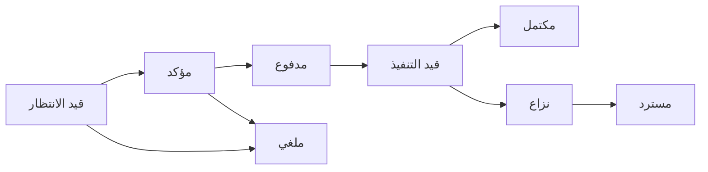

# تدفق الخدمة

دليلك لفهم كيفية عمل نظام الحجز والدفع لدينا.

## نظرة عامة

نظامنا يربط بين العملاء ومقدمي الخدمات بطريقة سلسة. تدفق العملية يضمن حقوق جميع الأطراف مع توفير تجربة مستخدم ممتازة.

### الأطراف المشاركة

- **العميل**: يبحث عن الخدمة ويحجزها
- **مقدم الخدمة**: يقدم الخدمة ويؤكد الحجز
- **نظام الدفع**: يعالج المدفوعات بأمان
- **نظام الإشعارات**: يبقي الجميع على اطلاع

## خطوات العملية

### 1. إنشاء الحجز

العميل يختار الخدمة ويحدد الموعد المناسب. النظام يتحقق من التوافق ويحسب السعر النهائي.

```
[عميل] → اختيار الخدمة → تحديد الموعد → إنشاء الحجز
```

### 2. تأكيد مقدم الخدمة

يصل إشعار لمقدم الخدمة بالحجز الجديد. يمكنه قبول أو رفض الحجز خلال 30 دقيقة.

### 3. الدفع الآمن

عند القبول، يتم إنشاء نية دفع آمنة. العميل يكمل الدفع باستخدام وسيلته المفضلة.

### 4. تنفيذ الخدمة

في الموعد المحدد، يبدأ مقدم الخدمة بتنفيذ الخدمة. يمكن تتبع الحالة لحظة بلحظة.

### 5. تأكيد الإكمال

بعد الانتهاء، يطلب مقدم الخدمة تأكيد الإكمال. العميل يستعرض ويؤكد رضاه.

## حالات الحجز



## إدارة المدفوعات

### كيفية عمل الدفع

1. **إنشاء نية الدفع**: النظام يتواصل مع مزود الدفع
2. **المصادقة**: العميل يؤكد الدفع باستخدام بطاقته
3. **التأكيد**: يتم تأمين المبلغ حتى إكمال الخدمة
4. **الصرف**: يتم تحويل المبلغ لمقدم الخدمة بعد التأكيد

### السياسات المالية

- **الاسترداد الكامل**: خلال 24 ساعة من الحجز
- **الاسترداد الجزئي**: حسب حالة الخدمة
- **حماية المشتري**: في حال عدم تطابق الخدمة

## معالجة المشكلات

### المشكلات الشائعة

| المشكلة | الحل |
|---------|------|
| فشل الدفع | إعادة المحاولة أو تغيير وسيلة الدفع |
| تأخر مقدم الخدمة | التواصل عبر النظام أو طلب الدعم |
| عدم رضا العميل | فتح نزاع لمراجعتها من الفريق |

### آلية النزاع

عند حدوث نزاع:

1. يتم تجميد المبلغ مؤقتاً
2. يتم إخطار جميع الأطراف
3. يتم مراجعة الأدلة من الجميع
4. يتخذ القرار النهائي خلال 7 أيام

## أفضل الممارسات

### للعملاء

- قراءة تفاصيل الخدمة بعناية
- التواصل بوضوح مع مقدم الخدمة
- تأكيد الموعد والموقع بدقة
- تقييم الخدمة بعد الإكمال

### لمقدمي الخدمات

- تحديث التوافر بانتظام
- الرد على الحجوزات خلال 30 دقيقة
- التواصل المبكر مع العملاء
- تقديم خدمة عالية الجودة

## الأسئلة الشائعة

**س: كم يستغرق تأكيد الحجز؟**
ج: عادة خلال 30 دقيقة من إنشائه.

**س: هل يمكنني تغيير موعد الحجز؟**
ج: نعم، قبل 24 ساعة من الموعد المحدد.

**س: ماذا يحدث إذا ألغى مقدم الخدمة؟**
ج: يتم استرداد المبلغ كاملاً خلال 3-5 أيام عمل.

**س: كيف أضمن جودة الخدمة؟**
ج: نوفر نظام تقييم ومراجعات مع آلية حماية للمشتري.

## التواصل والدعم

### قنوات الدعم

- **الدردشة المباشرة**: متاحة 24/7
- **البريد الإلكتروني**: support@platform.com
- **الهاتف**: 9200XXXXX

### أوقات الاستجابة

- الاستفسارات العامة: خلال ساعة
- مشكلات الدفع: خلال 30 دقيقة
- النزاعات: خلال 24 ساعة

---

هل تحتاج إلى مساعدة؟ تواصل مع فريق الدعم للحصول على المساعدة الفورية.