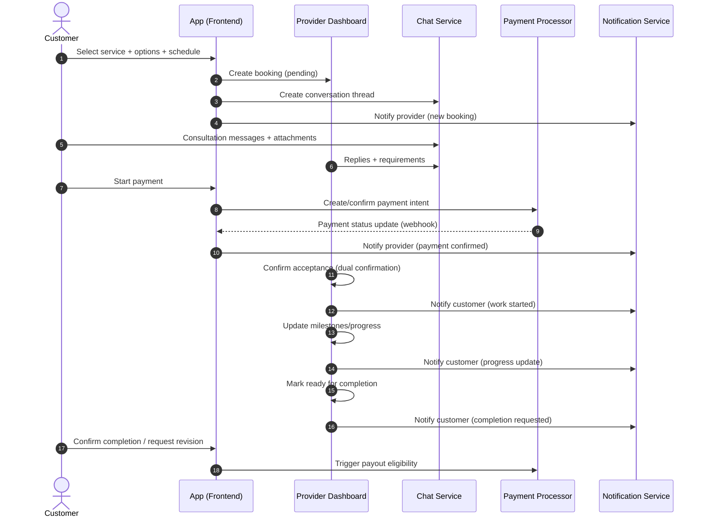
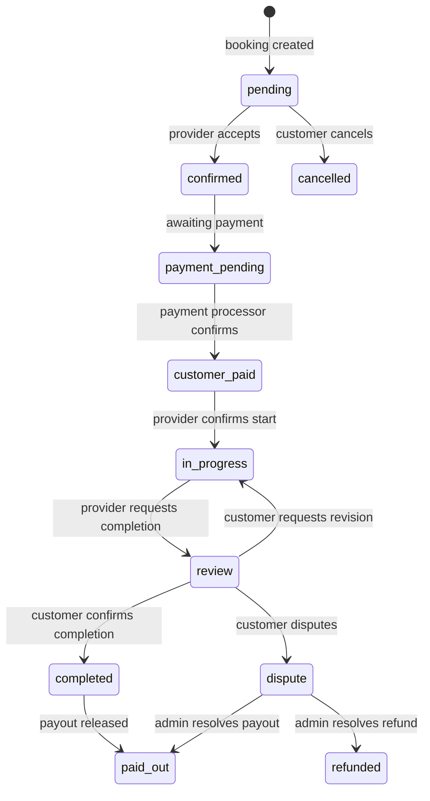

# End-to-End Service Flow (Booking → Completion)

## Overview

This document describes the complete service lifecycle from a customer booking a service to final completion confirmation and payout. It covers both user-facing behavior and backend workflow expectations.

## Actors

- Customer (end user)
- Provider (service provider in the dashboard)
- Support/Admin (disputes, refunds, moderation)
- Payment Processor (card/bank transfer, webhooks)
- Notification System (in-app, email, SMS)

## Step-by-Step Flow

### 1) Booking (Customer)

1. Customer selects a service.
2. Customer selects one or more **priced options** (e.g., “Room design”, “Home design”).
3. Customer chooses a schedule date/time (appointment).
4. Customer confirms booking details.
5. System creates a `Booking` in `pending` state and generates a calendar entry for the provider.

### 2) Chat Consultation (Customer ↔ Provider)

1. Booking automatically opens a conversation thread.
2. Customer shares requirements, images, attachments, and clarifications.
3. Provider confirms feasibility, timeline, and deliverables.
4. Provider can request changes before accepting the booking.

### 3) Payment Confirmation (Dual Confirmation)

1. Customer initiates payment.
2. Payment processor returns a payment intent result and emits webhooks.
3. Customer sees “Payment Confirmed” UI.
4. Provider sees “Payment Confirmed” badge and confirms acceptance to start work (second confirmation).

### 4) Service Provision (Provider)

1. Provider starts the service and updates progress milestones.
2. System tracks time-based milestones (SLA reminders, due dates).
3. Customer receives notifications on milestone updates.

### 5) Completion Confirmation (Customer ↔ Provider)

1. Provider marks service as “Ready for completion”.
2. Customer reviews and confirms completion OR requests revisions.
3. On completion confirmation, payout becomes eligible (after dispute window if applicable).

## Flow Diagram (Sequence)

## Booking Lifecycle (State Machine)

## Key UX Touchpoints (Current UI Reference)

- Provider dashboard calendar: `app/(dashboard)/dashboard/_components/ServiceCalendar.tsx`
- Chat: `app/(dashboard)/messages/page.tsx`
- Finance/Wallet: `app/(dashboard)/finance/page.tsx`
- Notifications: `app/(dashboard)/notifications/*`

## Screenshot Placeholders

- `docs/images/flow-dashboard.png`: Dashboard showing active bookings + calendar
- `docs/images/flow-chat.png`: Chat consultation view
- `docs/images/flow-finance.png`: Wallet + payout status

