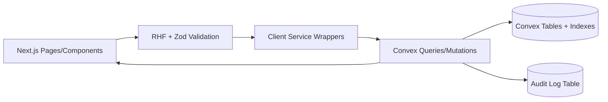
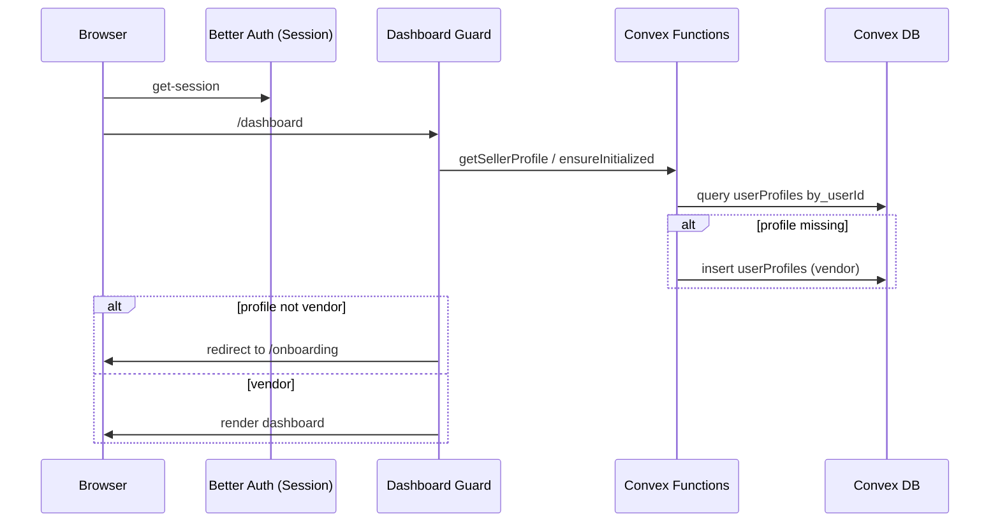

# Seller-Provider Architecture Diagrams

## CRUD Architecture



## Auth and Initialization Flow



## Index-Backed List Query Pattern

```mermaid
flowchart TB
  Q[Query args: providerId + filters + cursor] --> V[Validate filters]
  V --> IDX[Use .withIndex(...) for providerId]
  IDX --> PAGE[Apply pagination window]
  PAGE --> F[Optional secondary filter (small set only)]
  F --> R[Return page + nextCursor]
```

